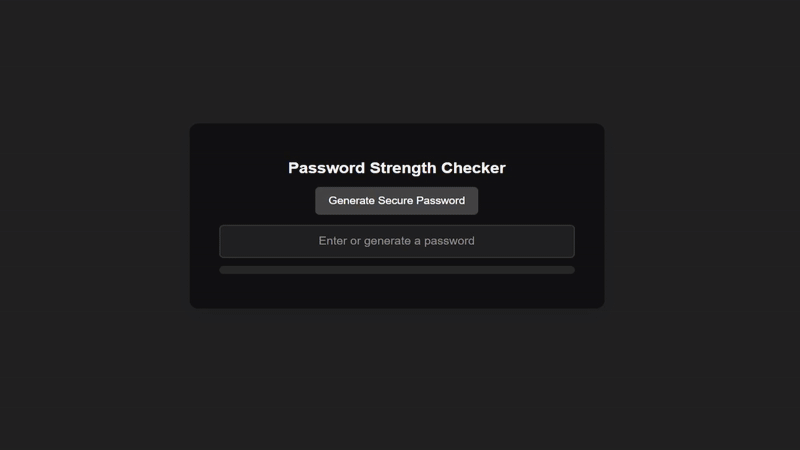

# Password Complexity Checker 🔒

This is a Flask-based web application that assesses password strength and checks for data breaches, ensuring users create stronger, more secure passwords. The backend (`app.py`) processes user-inputted passwords by evaluating their length, character diversity (uppercase, lowercase, digits, and special characters), and querying the Have I Been Pwned API to check if the password has been leaked, assigning a strength score and providing feedback for improvement. The frontend (`index.html`) features a clean, responsive UI with an input field, a secure password generator, a dynamic progress bar, and real-time strength feedback using JavaScript.

---

## 🚀 Features

- **Password Assessment:** Evaluates password strength based on length and character variety.
- **Data Breach Check:** Uses the Have I Been Pwned API to determine if the password has been compromised.
- **Real-Time Feedback:** Displays strength results and improvement suggestions instantly.
- **Password Generator:** Generates secure passwords following best practices.
- **Dynamic Progress Bar:** Visual indicator of password strength.
- **Responsive UI:** Clean and user-friendly design for both desktop and mobile users.

---

## 🛠️ Tech Stack

- **Frontend:** HTML, CSS, JavaScript
- **Backend:** Python, Flask
- **API:** Have I Been Pwned API for breach detection

---

## ⚙️ Installation

### Prerequisites

- Python 3.x or higher
- Flask
- Requests (Python package for HTTP requests)

### Steps to Run Locally

1. **Clone the repository:**

    ```bash
    git clone https://github.com/KashifMalik777/PRODIGY_CS_03.git
    ```

2. **Navigate to the project directory:**

    ```bash
    cd PRODIGY_CS_03-main
    ```

3. **Create a virtual environment (optional but recommended):**

    ```bash
    python3 -m venv venv
    source venv/bin/activate  # On Windows: venv\Scripts\activate
    ```

4. **Install the required packages:**

    ```bash
    pip install flask requests
    ```

5. **Run the Flask application:**

    ```bash
    python app.py
    ```

6. **Open your browser** and go to `http://127.0.0.1:5000/` to access the tool.

---

## 🧑‍💻 Usage

1. **Assess Password Strength:**
    - Enter or generate a password in the input field.
    - The tool evaluates the password and displays a strength score, suggestions for improvement, and a breach check result.

2. **Generate Secure Password:**
    - Click the "Generate Secure Password" button to create a password that meets all complexity requirements.
    - The generated password is automatically evaluated for strength and security.

3. **Real-Time Updates:**
    - As you type or generate a new password, the progress bar and feedback update in real-time.

---

## 📖 How It Works

The application uses a combination of regular expressions and secure API calls to assess password complexity. It checks for:
- **Length:** Minimum of 8 characters.
- **Character Diversity:** Presence of lowercase, uppercase, numeric, and special characters.
- **Breach Detection:** A SHA-1 hash of the password is generated and compared against known breaches via the Have I Been Pwned API.  

The backend returns a comprehensive score along with specific feedback on how to enhance password security.

---

## 🎨 Demo

Below is a preview of the user interface:



---

## 🤝 Contributing

Contributions are welcome! If you’d like to contribute to this project, please fork the repository, make your changes, and submit a pull request. Your feedback and improvements are appreciated.

---

## 🏷️ Tags

- Python
- Flask
- Password Security
- Web Application
- Data Breach Detection
- User Interface
- Cybersecurity

---

## 💬 Questions or Feedback?

If you have any questions, feedback, or issues, please feel free to open an issue on the GitHub repository or contact me directly at [md.kashif123490@gmail.com](mailto:your-email@example.com).

